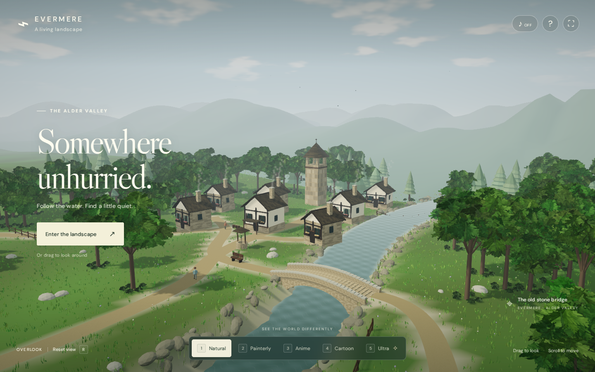

# Evermere

[Explore the live landscape](https://kubok758.github.io/Evermere/)

A living WebGL landscape: a small stone-and-timber village, wooded groves, wildflower meadows, a winding river and an arched bridge. Five rendering styles share the same world and animation.



## Controls

Drag to look; use WASD / arrow keys to move. Q / E descend and rise, Shift moves faster, the wheel glides, R restores the overlook, and H hides the interface. On touch screens, enter the landscape, use the left thumbstick and drag to look; plus/minus adjust height. Nature ambience is opt-in.

| Key | Style | Rendering treatment |
| --- | --- | --- |
| 1 | [Natural](qa/evidence/mode-1.png) | PBR materials, sun shadows, atmospheric haze |
| 2 | [Painterly](qa/evidence/mode-2.png) | Stepped colored light, world-space brush variation, paper grain |
| 3 | [Anime](qa/evidence/mode-3.png) | Cel lighting, fine contours, simplified sky and water |
| 4 | [Cartoon](qa/evidence/mode-4.png) | Two-band light, stronger contours, vivid color |
| 5 | [Ultra](qa/evidence/mode-5.png) | Golden-hour sun, finer long shadows, local ambient occlusion, bloom |

Ultra is an enhanced rasterized WebGL mode with a distinct low-sun lighting setup. It does not implement ray tracing or claim AAA engine parity.

## Develop and publish

Use Node.js 22.12 or newer.

```sh
npm ci
npm run dev
npm run build:pages
```

`build:pages` builds `dist/` and stages the production files in `docs/`. Commit the updated source and `docs/`, then push `main`. GitHub Pages is configured to deploy **main / docs**. Relative asset paths support the `/Evermere/` project URL. The optional Actions-based deployment example is in `deployment-examples/pages.yml`.

Geometry, texture maps and ambience are generated locally; no API key or backend is needed. Google Fonts is optional, with installed-font fallbacks. Vegetation uses instancing and spatial groups; the renderer caps pixel count on large/high-DPI displays.

## Verification

The GitHub Actions render workflow launches Chromium with software WebGL, captures all five modes plus village/bridge/forest viewpoints, and checks keyboard movement, mouse look, reset, help, touch movement, mobile style selection and layout. It also renders the public Pages URL and compares its script filename with the tested build. Animation is paused only during screenshot capture.

Final evidence is in `qa/evidence/`, including browser results, geometry/contact measurements and screenshots. See `GATES.md` for the Unlazy gate ledger and the visual refinement log. Software-renderer timing is not a hardware FPS benchmark; performance on physical desktop and mobile devices has not been measured.
